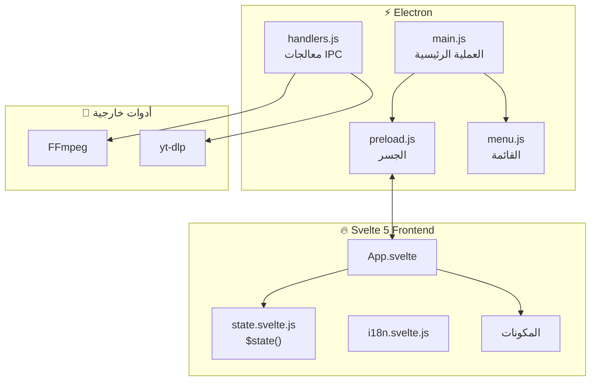

# دليل المطورين الشامل - Afidna Cutter
## Developer Comprehensive Guide

> **الإصدار**: 2.0.0  
> **تاريخ التحديث**: 2025-12-10

---

## 📑 فهرس المحتويات / Table of Contents

1. [نظرة عامة على المشروع / Project Overview](#1-نظرة-عامة-على-المشروع--project-overview)
2. [التكنولوجيات المستخدمة / Technology Stack](#2-التكنولوجيات-المستخدمة--technology-stack)
3. [هيكل المشروع / Project Structure](#3-هيكل-المشروع--project-structure)
4. [الهندسة المعمارية / Architecture](#4-الهندسة-المعمارية--architecture)
5. [عملية Electron الرئيسية / Electron Main Process](#5-عملية-electron-الرئيسية--electron-main-process)
6. [واجهة المستخدم Svelte 5 / Svelte 5 Frontend](#6-واجهة-المستخدم-svelte-5--svelte-5-frontend)
7. [إدارة الحالة / State Management](#7-إدارة-الحالة--state-management)
8. [نظام الترجمة / Internationalization (i18n)](#8-نظام-الترجمة--internationalization-i18n)
9. [نظام السمات / Theming System](#9-نظام-السمات--theming-system)
10. [معالجة الفيديو / Video Processing](#10-معالجة-الفيديو--video-processing)
11. [تكامل YouTube / YouTube Integration](#11-تكامل-youtube--youtube-integration)
12. [البناء والتوزيع / Build & Distribution](#12-البناء-والتوزيع--build--distribution)
13. [بيئة التطوير / Development Environment](#13-بيئة-التطوير--development-environment)
14. [الإرشادات والممارسات / Best Practices](#14-الإرشادات-والممارسات--best-practices)
15. [استكشاف الأخطاء / Troubleshooting](#15-استكشاف-الأخطاء--troubleshooting)

---

## 1. نظرة عامة على المشروع / Project Overview

### الوصف / Description

**Afidna Cutter** هو تطبيق سطح مكتب احترافي لتقطيع الفيديو والصوت. يتيح للمستخدم:

- تقطيع ملفات الفيديو/الصوت المحلية
- تحميل وتقطيع فيديوهات YouTube مباشرة
- تحديد مقاطع متعددة وتصديرها دفعة واحدة
- واجهة مستخدم ثنائية اللغة (عربي/إنجليزي)
- ثلاثة سمات للواجهة (Midnight, Ocean, Sunset)

### الميزات الرئيسية / Key Features

| الميزة | الوصف |
|--------|-------|
| 🎬 تقطيع الفيديو | قص دقيق باستخدام FFmpeg |
| 📺 دعم YouTube | تحليل وتحميل وتقطيع فيديوهات YouTube |
| ⚡ Timeline تفاعلي | رسم Canvas مع دعم السحب والإفلات |
| 🌍 ثنائي اللغة | عربي وإنجليزي مع دعم RTL |
| 🎨 سمات متعددة | 3 سمات مدمجة |
| 🖥️ متعدد المنصات | Linux و Windows |

---

## 2. التكنولوجيات المستخدمة / Technology Stack

### Frontend (واجهة المستخدم)

| التقنية | الإصدار | الغرض |
|---------|---------|-------|
| **Svelte** | ^5.45.3 | إطار عمل الواجهة (Runes API) |
| **Vite** | ^7.2.6 | أداة البناء والتطوير |
| **TailwindCSS** | ^4.1.17 | إطار CSS utility-first |
| **DaisyUI** | ^5.5.5 | مكتبة مكونات UI |

### Backend (الخلفية)

| التقنية | الإصدار | الغرض |
|---------|---------|-------|
| **Electron** | ^39.2.4 | تطبيق سطح المكتب |
| **Node.js** | 18+ | بيئة التشغيل |
| **FFmpeg** | System/Bundled | معالجة الفيديو |
| **yt-dlp** | System | تحميل YouTube |

### أدوات التطوير / Dev Tools

| الأداة | الغرض |
|--------|-------|
| electron-builder | بناء وتوزيع التطبيق |
| @sveltejs/vite-plugin-svelte | تكامل Svelte مع Vite |
| @tailwindcss/vite | تكامل TailwindCSS v4 مع Vite |
| concurrently | تشغيل مهام متوازية |
| wait-on | انتظار توفر الخدمات |

### التبعيات الخارجية / External Dependencies

```bash
# مطلوب على النظام لـ YouTube
yt-dlp

# مطلوب لمعالجة الفيديو (Linux)
ffmpeg ffprobe

# Windows: يتم تضمينهم في resources/bin/win/
```

---

## 3. هيكل المشروع / Project Structure

```
afidnaCutter/
├── 📁 src/                          # كود Svelte (Frontend)
│   ├── 📄 main.js                   # نقطة دخول Svelte
│   ├── 📄 App.svelte                # المكون الرئيسي
│   ├── 📄 app.css                   # الأنماط العامة + السمات
│   ├── 📁 lib/
│   │   └── 📄 state.svelte.js       # إدارة الحالة ($state)
│   ├── 📁 stores/
│   │   └── 📄 i18n.svelte.js        # نظام الترجمة
│   ├── 📄 Navbar.svelte             # شريط التنقل
│   ├── 📄 InputSection.svelte       # إدخال الملف/YouTube
│   ├── 📄 VideoPlayer.svelte        # مشغل الفيديو
│   ├── 📄 Timeline.svelte           # الخط الزمني (Canvas)
│   ├── 📄 Controls.svelte           # أزرار التحكم
│   ├── 📄 Sidebar.svelte            # الشريط الجانبي (المقاطع)
│   └── 📄 Modal.svelte              # مكون النافذة المنبثقة
│
├── 📁 Electron Backend
│   ├── 📄 main.js                   # العملية الرئيسية
│   ├── 📄 preload.js                # جسر Main ↔ Renderer
│   ├── 📄 handlers.js               # معالجات IPC
│   └── 📄 menu.js                   # قائمة التطبيق
│
├── 📁 resources/                    # موارد التطبيق
│   ├── 📁 bin/win/                  # FFmpeg لـ Windows
│   └── 🖼️ icon.png                  # أيقونة التطبيق
│
├── 📁 build/                        # أيقونات البناء
├── 📁 dist/                         # مخرجات Vite build
├── 📁 release/                      # ملفات التوزيع
│
├── 📄 package.json                  # تكوين المشروع
├── 📄 vite.config.mjs               # تكوين Vite
├── 📄 index.html                    # نقطة دخول HTML
└── 📄 README.md                     # توثيق أساسي
```

---

## 4. الهندسة المعمارية / Architecture

### مخطط التطبيق / Application Flow



### نمط الاتصال / Communication Pattern

```
┌─────────────────┐    IPC invoke    ┌─────────────────┐
│   Renderer      │ ───────────────► │   Main Process  │
│   (Svelte)      │                  │   (Node.js)     │
│                 │ ◄─────────────── │                 │
└─────────────────┘    IPC response  └─────────────────┘
         │                                    │
         │                                    ▼
         │                          ┌─────────────────┐
         │                          │ FFmpeg / yt-dlp │
         │                          └─────────────────┘
         ▼
┌─────────────────┐
│  $state()       │
│  Reactive State │
└─────────────────┘
```

---

## 5. عملية Electron الرئيسية / Electron Main Process

### 5.1 main.js - نقطة الدخول

```javascript
// الوظائف الرئيسية:
// 1. إنشاء نافذة التطبيق
// 2. تهيئة معالجات IPC
// 3. إعداد القائمة
// 4. حجب الإعلانات
// 5. منع تعليق التطبيق

const { app, BrowserWindow, powerSaveBlocker, Menu } = require('electron/main');

// منع التعليق عند التصغير
powerSaveBlocker.start('prevent-app-suspension');

// حجب طلبات الإعلانات
session.defaultSession.webRequest.onBeforeRequest(adFilter, (details, callback) => {
    callback({ cancel: true });
});
```

### 5.2 handlers.js - معالجات IPC

| المعالج | الوظيفة |
|---------|---------|
| `upload-video` | رفع ملف فيديو محلي |
| `cut-video` | قص مقاطع من فيديو محلي |
| `select-file` | فتح مربع حوار اختيار ملف |
| `analyze-youtube` | تحليل رابط YouTube |
| `download-full-youtube` | تحميل فيديو YouTube كامل |
| `cut-youtube` | تحميل وقص مقاطع من YouTube |
| `open-folder` | فتح مجلد المخرجات |
| `open-youtube-window` | فتح نافذة YouTube مدمجة |
| `open-external` | فتح رابط في المتصفح |

### 5.3 preload.js - Context Bridge

```javascript
// تعريض APIs آمنة للـ Renderer
contextBridge.exposeInMainWorld('electron', {
    invoke: (channel, data) => ipcRenderer.invoke(channel, data),
    on: (channel, func) => {
        const validChannels = ['open-about', 'download-progress'];
        if (validChannels.includes(channel)) {
            ipcRenderer.on(channel, (event, ...args) => func(...args));
        }
    },
    removeListener: (channel, func) => ipcRenderer.removeListener(channel, func)
});
```

---

## 6. واجهة المستخدم Svelte 5 / Svelte 5 Frontend

### 6.1 المكونات / Components

| المكون | الملف | الوظيفة |
|--------|-------|---------|
| **App** | `App.svelte` | المكون الجذر، اختصارات لوحة المفاتيح |
| **Navbar** | `Navbar.svelte` | شريط التنقل، اللغة، السمة |
| **InputSection** | `InputSection.svelte` | إدخال الملف/YouTube، تبويبات |
| **VideoPlayer** | `VideoPlayer.svelte` | مشغل HTML5/YouTube IFrame |
| **Timeline** | `Timeline.svelte` | Canvas تفاعلي، تحديد المقاطع |
| **Controls** | `Controls.svelte` | أزرار التشغيل، السرعة |
| **Sidebar** | `Sidebar.svelte` | قائمة المقاطع، تحرير، قص |
| **Modal** | `Modal.svelte` | نافذة منبثقة قابلة لإعادة الاستخدام |

### 6.2 استخدام Svelte 5 Runes

المشروع يستخدم **Svelte 5 Runes API** بشكل كامل:

```javascript
// ✅ $state - الحالة التفاعلية
let showModal = $state(false);
let selectedQuality = $state("360");

// ✅ $props - خصائص المكون
let { isOpen, title, children, onClose } = $props();

// ✅ $derived - القيم المشتقة
let isAudio = $derived(
    appState.videoFilename?.match(/\.(mp3|wav|ogg|m4a)$/i)
);

// ✅ $effect - التأثيرات التفاعلية
$effect(() => {
    appState.theme;
    setTimeout(() => updateThemeColors(), 50);
});

// ✅ $state.snapshot - نسخة ثابتة من الحالة
const segments = $state.snapshot(appState.segments);
```

### 6.3 معالجة الأحداث / Event Handling

```svelte
<!-- ✅ Svelte 5: onclick بدون : -->
<button onclick={() => handleClick()}>Click</button>

<!-- ✅ Svelte 5: onClose prop -->
<Modal isOpen={show} onClose={() => show = false}>
    {@render children()}
</Modal>
```

---

## 7. إدارة الحالة / State Management

### 7.1 الحالة العامة / Global State

الملف: `src/lib/state.svelte.js`

```javascript
export const appState = $state({
    // وضع التشغيل
    mode: 'upload',           // 'youtube' | 'upload'
    activeTab: 'local',       // 'local' | 'youtube'
    
    // الفيديو المحلي
    videoSrc: null,
    videoFilename: null,
    sessionId: null,
    
    // التشغيل
    duration: 0,
    currentTime: 0,
    isPlaying: false,
    playbackRate: 1.0,
    
    // المقاطع
    segments: [],
    currentStart: null,
    
    // YouTube
    youtubePlayer: null,
    youtubeVideoId: null,
    youtubeUrl: '',
    youtubeMetadata: null,
    youtubeAnalyzing: false,
    youtubeQuality: '360',
    
    // حالة التحميل
    downloadStatus: { status: 'idle', progress: 0 },
    
    // واجهة المستخدم
    isDragging: false,
    showAboutModal: false,
    hoverTime: null,
    isHoveringTimeline: false,
    theme: 'midnight'
});
```

### 7.2 الدوال المساعدة / Helper Functions

```javascript
// تنسيق الوقت mm:ss.ms
export function formatTime(seconds) { ... }

// إضافة مقطع جديد
export function addSegment(start, end) { ... }

// ترتيب المقاطع
export function sortSegments() { ... }

// إعادة تعيين الحالة
export function resetState() { ... }
```

---

## 8. نظام الترجمة / Internationalization (i18n)

### 8.1 الهيكل / Structure

الملف: `src/stores/i18n.svelte.js`

```javascript
export const translations = {
    ar: {
        appTitleShort: "أفدنا القاطع",
        youtube: "يوتوب",
        localFile: "ملف محلي",
        // ... 100+ مفتاح ترجمة
    },
    en: {
        appTitleShort: "AFIDNA CUTTER",
        youtube: "YouTube",
        localFile: "Local File",
        // ...
    }
};

let currentLang = $state("ar");

export const i18n = {
    get lang() { return currentLang; },
    set lang(v) { currentLang = v; },
    t: (key) => translations[currentLang][key] || key
};
```

### 8.2 الاستخدام / Usage

```svelte
<script>
    import { i18n } from "./stores/i18n.svelte.js";
</script>

<div dir={i18n.lang === "ar" ? "rtl" : "ltr"}>
    <h1>{i18n.t("appTitleLong")}</h1>
</div>
```

### 8.3 فئات الترجمة / Translation Categories

- واجهة عامة (UI)
- أزرار التحكم
- الرسائل والتنبيهات
- القوائم (File, View, Help)
- قائمة السياق (Context Menu)
- رسائل الأخطاء

---

## 9. نظام السمات / Theming System

### 9.1 السمات المتوفرة / Available Themes

| السمة | الوصف | الألوان الرئيسية |
|-------|-------|-----------------|
| 🌑 Midnight | داكن، بنفسجي | `#7C3AED` Primary |
| 🌊 Ocean | فاتح، أزرق | `#0284C7` Primary |
| 🌅 Sunset | داكن، برتقالي | `#F97316` Primary |

### 9.2 التطبيق / Implementation

الملف: `src/app.css`

```css
/* تعريف السمات باستخدام CSS Custom Properties */
:root:has(.midnight), .midnight {
    --color-base-100: #0F172A;
    --color-primary: #7C3AED;
    /* ... */
}

:root:has(.ocean), .ocean {
    --color-base-100: #FFFFFF;
    --color-primary: #0284C7;
    /* ... */
}
```

### 9.3 تبديل السمة / Theme Switching

```javascript
function setTheme(theme) {
    appState.theme = theme;
    document.documentElement.className = theme;
    localStorage.setItem("theme", theme);
}
```

---

## 10. معالجة الفيديو / Video Processing

### 10.1 قص الفيديو المحلي / Local Video Cutting

```javascript
// handlers.js
ffmpeg(inputPath)
    .setStartTime(start)
    .setDuration(end - start)
    .outputOptions(['-c copy'])  // نسخ بدون إعادة ترميز
    .output(outputPath)
    .on('end', () => resolve())
    .on('error', (err) => reject(err))
    .run();
```

### 10.2 قص فيديو YouTube / YouTube Cutting

1. **دمج المقاطع المتقاربة**: تقليل عدد التحميلات
2. **التحميل الجزئي**: `--download-sections`
3. **الاستخراج**: FFmpeg للقص الدقيق

```javascript
// خوارزمية دمج المقاطع
function mergeSegments(segments, gapThreshold = 5) {
    // دمج المقاطع التي بينها أقل من 5 ثوانٍ
}
```

---

## 11. تكامل YouTube / YouTube Integration

### 11.1 التحليل / Analysis

```javascript
// استخدام yt-dlp --dump-json
const ytdlp = spawn('yt-dlp', ['--dump-json', '--no-playlist', url]);
```

### 11.2 IFrame API

```javascript
appState.youtubePlayer = new window.YT.Player(container, {
    videoId: videoId,
    playerVars: {
        autoplay: 1,
        controls: 1,
        modestbranding: 1,
        rel: 0,
        // ...
    },
    events: { onReady, onStateChange, onError }
});
```

### 11.3 حجب الإعلانات / Ad Blocking

- **مستوى الشبكة**: `webRequest.onBeforeRequest`
- **مستوى CSS**: إخفاء عناصر الإعلانات
- **مستوى JS**: تخطي الإعلانات تلقائياً

---

## 12. البناء والتوزيع / Build & Distribution

### 12.1 الأوامر / Commands

```bash
# التطوير
yarn dev          # Vite + Electron dev mode

# البناء
yarn build        # Vite build فقط

# التوزيع
yarn dist         # Vite build + electron-builder
yarn dist --linux # Linux فقط
yarn dist --win   # Windows فقط (cross-compile)
```

### 12.2 تكوين electron-builder

```json
{
    "build": {
        "appId": "com.afidnacutter.app",
        "productName": "Afidna Cutter",
        "linux": { "target": ["deb"] },
        "win": { "target": ["nsis"] },
        "extraResources": [
            { "from": "resources/bin/win", "to": "bin/win" }
        ]
    }
}
```

### 12.3 مسارات المخرجات / Output Paths

| المنصة | الملف |
|--------|-------|
| Linux | `release/*.deb` |
| Windows | `release/*Setup*.exe` |

---

## 13. بيئة التطوير / Development Environment

### 13.1 المتطلبات / Requirements

```bash
# Node.js 18+
node --version

# Yarn أو npm
yarn --version

# أدوات النظام (Linux)
sudo apt install ffmpeg yt-dlp

# Windows: ضع ffmpeg.exe في resources/bin/win/
```

### 13.2 الإعداد / Setup

```bash
git clone https://github.com/salahAit/afidnaCutter.git
cd afidnaCutter
yarn install
yarn dev
```

### 13.3 متغيرات البيئة / Environment

```bash
NODE_ENV=development  # وضع التطوير (يحمل من localhost:5173)
NODE_ENV=production   # وضع الإنتاج (يحمل من dist/)
```

---

## 14. الإرشادات والممارسات / Best Practices

### 14.1 Svelte 5 Guidelines

```javascript
// ✅ استخدم $state بدلاً من let للحالة التفاعلية
let count = $state(0);

// ✅ استخدم $props بدلاً من export let
let { value } = $props();

// ✅ استخدم $effect للتأثيرات الجانبية
$effect(() => { /* ... */ });

// ✅ استخدم onclick بدلاً من on:click
<button onclick={handler}>

// ✅ استخدم @render للمحتوى المُمرر
{@render children()}
```

### 14.2 إدارة الحالة / State Management

```javascript
// ✅ استخدم appState المركزي
import { appState } from "./lib/state.svelte.js";

// ✅ استخدم $state.snapshot للنسخ الثابتة
const copy = $state.snapshot(appState.segments);

// ❌ تجنب التعديل المباشر في الخلفية
```

### 14.3 IPC Communication

```javascript
// ✅ استخدم invoke للعمليات async
const result = await window.electron.invoke('cut-video', data);

// ✅ استخدم on للأحداث المستمرة
window.electron.on('download-progress', handler);
```

---

## 15. استكشاف الأخطاء / Troubleshooting

### 15.1 أخطاء شائعة / Common Issues

| المشكلة | الحل |
|---------|------|
| `yt-dlp not found` | تثبيت yt-dlp على النظام |
| `ffmpeg error` | التأكد من تثبيت FFmpeg |
| `ENOTDIR` في الإنتاج | استخدام `app.getPath('userData')` |
| تحذيرات Svelte | استخدام Svelte 5 syntax |

### 15.2 تصحيح الأخطاء / Debugging

```bash
# فتح DevTools
View → Toggle Developer Tools

# عرض سجلات الـ Main Process
# تظهر في Terminal عند تشغيل yarn dev
```

### 15.3 إعادة التعيين / Reset

```bash
rm -rf node_modules yarn.lock
yarn install
```

---

## 📝 المساهمة / Contributing

1. Fork المستودع
2. إنشاء فرع: `git checkout -b feature/amazing-feature`
3. Commit: `git commit -m 'Add amazing feature'`
4. Push: `git push origin feature/amazing-feature`
5. فتح Pull Request

---

## 📄 الترخيص / License

ISC License © 2025 Salah Ait Amgran

---

> **ملاحظة**: هذا الدليل مخصص للمطورين. راجع `guide.html` لدليل المستخدم.
